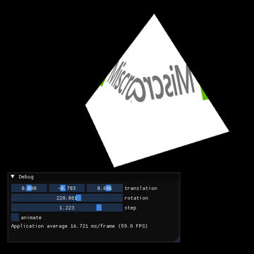

# Guglielmo



This project is ment to be a place for messing around with OpenGL.

## Quick start

To build the project you can run the following

```bash
make
```

## Dependencies
Prerequisites: glfw3, glew, glm
